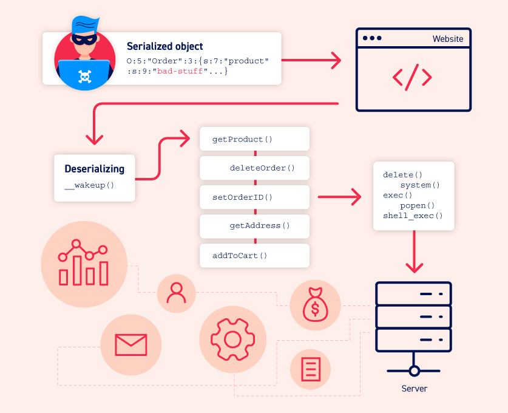

> Ocorre quando os dados controláveis ​​pelo usuário são desserializados por um site. Isso potencialmente permite que um invasor manipule objetos serializados para passar dados nocivos para o código do aplicativo. 

# Ferramentas

* https://github.com/frohoff/ysoserial (Java)
* https://github.com/ambionics/phpggc (PHP)
* https://github.com/pwntester/ysoserial.net (.NET)

# Truques

